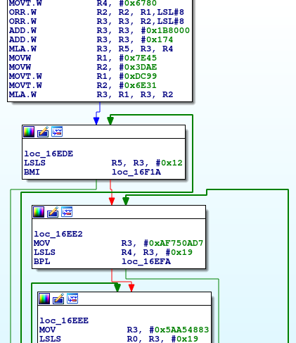

> "*A popular tourist attraction of the region, the biting pear lives off low-flying birds, hand-outs, and the occasional unwary sightseer.*" --&nbsp;[ursulav](http://ursulav.deviantart.com/art/The-Biting-Pear-of-Salamanca-29677500)

[](https://travis-ci.org/tkchia/innocent-pear)

## Description

`innocent-pear-c++` is a wrapper around the GNU C++ compiler (`g++`(1)) or `clang++` compiler which tries to obscure the code of compiled programs.  If the switches `-Xinnocent-pear -doge` are specified, `innocent-pear-c++` scrambles parts of the text and data sections of a program and adds constructor routines to unscramble them.

`innocent-pear-cc` is a wrapper for `gcc` or `clang`, for compiling C or assembly language modules to be linked into an `innocent-pear-c++` program.

`innocent-pear-c++` and `innocent-pear-cc` are being tested with x86-64, x86-32, and 32-bit ARM target platforms, and *may* partially work with other targets.

There is also a rather undocumented C++ API for various code obfuscation subtasks, and `innocent-pear-c++` enables some syntactic sugar for expressing obfuscated strings.



## Synopsis

#### Installation

> `git clone --recursive https://github.com/tkchia/innocent-pear.git`

> ...*install* `g++` *or* `clang++`, *and* `libbfd`...

> [*source-path*`/`]`configure` [`--prefix=`*install-path*] [`--target=`*target-arch*] [`--target-dir=`*target-install-path*] [...]

> `make check`

> `make install`

#### Use

> [*install-path*`/bin/`]`innocent-pear-c++` [`-Xinnocent-pear -doge`] [...] [*g++-options*...]

> [*install-path*`/bin/`]`innocent-pear-cc` [`-Xinnocent-pear -doge`] [...] [*gcc-options*...]

## Bugs

**(1)** The scrambling of text and data is probably not yet very strong.

**(2)** The C++ API should really be documented.

**(3)** The `innocent-pear-c++` wrapper does not understand the `-###` command line option, even though it itself may call the underlying compiler with `-###` internally.

**(4)** GNU "indirect functions" (as via `__attribute__((ifunc(.)))` in `gcc`) do not work properly yet.

Generally, the problem is some `ifunc` resolver routines might be scrambled, and `libc`'s startup code might call these resolvers before they are unscrambled.

I have put in place a quick fix which should allow indirect functions defined in `glibc` to work for now.

**(5)** If `innocent-pear` is explicitly set up to compile target-side programs

  * using `clang++`
  * with `libstdc++` linked in dynamically (i.e. no `-static` or `-static-libstdc++`)
  * where the programs handle exceptions,

the programs may fail with a runtime error on certain platforms, including x86-64 and x86-32:

```
./test/test-doge-eh.debug: error while loading shared libraries: unexpected reloc type 0x18
```

This is because I have not found a clean way to break up the absolute relocations referring to RTTI structures in `libstdc++` (`_ZTIi`, etc.), or to separate the relocations from the scrambled data.

Linux/ARM32 platforms (`arm*-linux-gnueabi` and `arm*-linux-gnueabihf`) should be free of this problem, since ARM exception tables are position independent.
